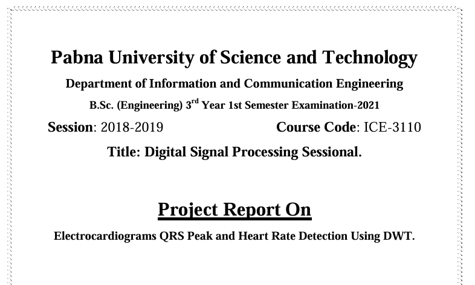
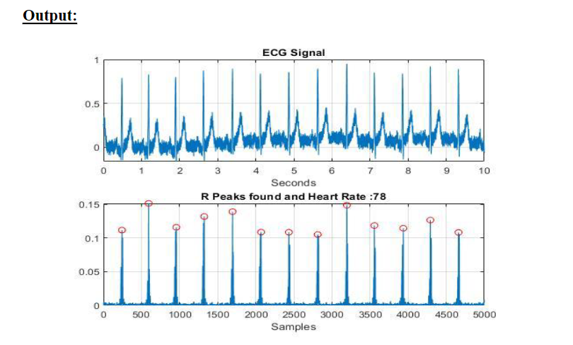

# ELECTROCARDIOGRAM

[![Youtube][youtube-shield]][youtube-url]
[![Facebook][facebook-shield]][facebook-url]
[![Instagram][instagram-shield]][instagram-url]
[![LinkedIn][linkedin-shield]][linkedin-url]

Thanks for visiting my GitHub account!

**The Electrocardiogram (ECG)** is widely used for diagnosis of heart diseases. Generally, the recorded ECG signal is often contaminated by noise. In order to extract useful information from the noisy ECG signals, the raw ECG signals has to be processed. The baseline wandering is significant and can strongly affect ECG signal analysis. The detection of QRS complexes in an ECG signal provides information about the heart rate, the conduction velocity, the condition of tissues within the heart as well as various abnormalities. It supplies evidence for the diagnosis of cardiac diseases. An algorithm based on wavelet transforms (WT's) has been developed for detecting ECG characteristic points. Discrete Wavelet Transform (DWT) has been used to extract relevant information from the ECG signal in order to perform classification. The QRS complex can be distinguished from high P or T waves, noise, baseline drift, and artifacts. By using this method, the detection rate of QRS complexes is above 99.8% for the MIT/BIH database and the P and T waves can also be detected, even with serious base line drift and noise.[see-more](https://www.youtube.com/watch?v=6VFm5Ov5rJU&t=199s)

## Source Code (Download)

[Click Here](https://mega.nz/folder/tL00VSoQ#E4snCVQ3MAKOd-Nss7sWEA)

## Required Software (Download)

- MATLAB, Download ->https://github.com/learnwithfair/matlab-installation

## Project Features

|                              |                               |
| :--------------------------: | :---------------------------: |
|            Index             |            Output             |
|  |  |

## Follow Me

    

<!-- MARKDOWN LINKS & IMAGES -->

[youtube-shield]: https://img.shields.io/badge/-Youtube-black.svg?style=flat-square&logo=youtube&color=555&logoColor=white
[youtube-url]: https://youtube.com/@learnwithfair
[facebook-shield]: https://img.shields.io/badge/-Facebook-black.svg?style=flat-square&logo=facebook&color=555&logoColor=white
[facebook-url]: https://facebook.com/learnwithfair
[instagram-shield]: https://img.shields.io/badge/-Instagram-black.svg?style=flat-square&logo=instagram&color=555&logoColor=white
[instagram-url]: https://instagram.com/learnwithfair
[linkedin-shield]: https://img.shields.io/badge/-LinkedIn-black.svg?style=flat-square&logo=linkedin&colorB=555
[linkedin-url]: https://linkedin.com/company/learnwithfair
